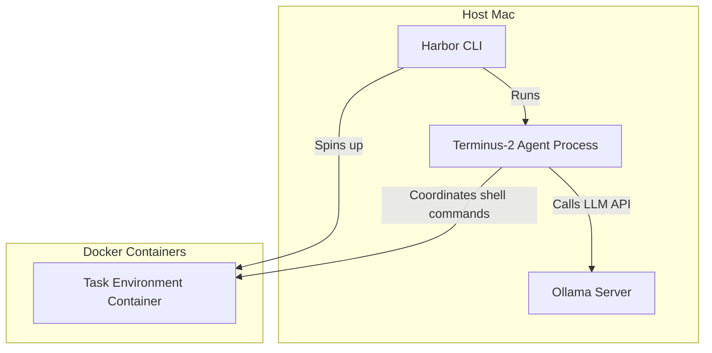

# Local Coding Model Benchmarking with Harbor, Terminus-2, and Ollama

This repository contains the setup, requirements, and instructions for running local agentic benchmarks using the **Harbor** harness, the **Terminus-2** agent, and local models served via **Ollama**.

---

## Architecture Overview



---

## Prerequisites

1. **Docker / OrbStack**: Ensure Docker is running.
2. **uv**: Install via `brew install uv`.
3. **Harbor**: Install via `uv tool install harbor`.
4. **Ollama Desktop**: Install and ensure the server is serving the API at `http://127.0.0.1:11434`.

---

## Setup & Optimization Guide

When running large local models (like `qwen3.6:35b-mlx`), the default context window (e.g. 262K tokens) requires a massive KV cache that can easily exceed the unified memory/VRAM of your Mac. This forces the system to swap virtual memory heavily, causing extreme latency (frequent timeouts).

Follow these steps to optimize the setup:

### 1. Limit the Model Context Size (Ollama Modelfile)
Limit the context size to `64K` (or `32K`) to keep the KV cache within GPU memory.

Create a file named `Modelfile`:
```dockerfile
FROM qwen3.6:35b-mlx
PARAMETER num_ctx 65536
```

Then build the optimized model:
```bash
ollama create qwen3.6:35b-mlx-64k -f Modelfile
```

Verify it is registered:
```bash
ollama list
```

### 2. Guard Against Model Thrashing
Ollama unloads the active model if another request arrives for a different model. Make sure other background processes (like IDE test suites running `gemma4` or other local models) are paused or finished before starting the benchmark.

---

## Running Benchmarks

### 1. Hello-World Smoke Test
Run a quick, single-task test to verify the communication chain:
```bash
MODEL='qwen3.6:35b-mlx-64k'

harbor run \
  -d harbor/hello-world \
  -a terminus-2 \
  -m "ollama_chat/$MODEL" \
  --ak api_base=http://127.0.0.1:11434 \
  --ak temperature=0 \
  --ak max_turns=50 \
  --ak 'model_info={"max_input_tokens":65536,"max_output_tokens":8192,"input_cost_per_token":0,"output_cost_per_token":0}' \
  -n 1
```

### 2. Three-Task Terminal-Bench Test
Run a 3-task smoke test. Because complex tasks generate deep reasoning chains, we increase:
- Harbor's agent timeout multiplier: `--agent-timeout-multiplier 3` (increases trial timeout to 45 minutes)
- LiteLLM's HTTP request timeout: `--ak 'llm_call_kwargs={"timeout":1800}'` (increases request timeout to 30 minutes)

```bash
MODEL='qwen3.6:35b-mlx-64k'

harbor run \
  --job-name "qwen36-35b-mlx-64k-tb21-smoke-timeout" \
  -d terminal-bench/terminal-bench-2-1 \
  -a terminus-2 \
  -m "ollama_chat/$MODEL" \
  --agent-timeout-multiplier 3 \
  --ak api_base=http://127.0.0.1:11434 \
  --ak temperature=0 \
  --ak max_turns=100 \
  --ak 'model_info={"max_input_tokens":65536,"max_output_tokens":8192,"input_cost_per_token":0,"output_cost_per_token":0}' \
  --ak 'llm_call_kwargs={"timeout":1800}' \
  -l 3 \
  -k 1 \
  -n 1
```

### 3. Full Benchmark
To run the full 89-task benchmark, remove the `-l 3` limit:
```bash
MODEL='qwen3.6:35b-mlx-64k'

harbor run \
  --job-name "qwen36-35b-mlx-64k-tb21-full" \
  -d terminal-bench/terminal-bench-2-1 \
  -a terminus-2 \
  -m "ollama_chat/$MODEL" \
  --agent-timeout-multiplier 3 \
  --ak api_base=http://127.0.0.1:11434 \
  --ak temperature=0 \
  --ak max_turns=100 \
  --ak 'model_info={"max_input_tokens":65536,"max_output_tokens":8192,"input_cost_per_token":0,"output_cost_per_token":0}' \
  --ak 'llm_call_kwargs={"timeout":1800}' \
  -k 1 \
  -n 1
```

---

## Analyzing Results

Launch Harbor's local UI viewer to inspect task trajectories, terminal inputs/outputs, rewards, and token logs:
```bash
harbor view jobs
```
This opens the job comparison dashboard in your web browser.
